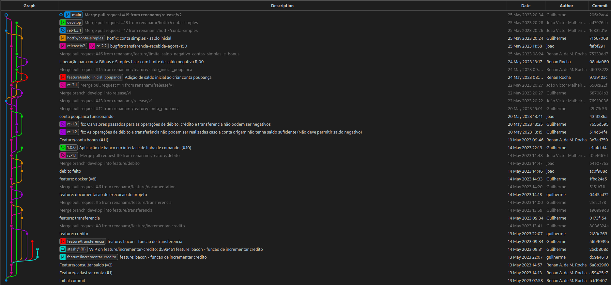

# Banco_DIM0517
Projeto para matéria DIM0517 - GERÊNCIA DE CONFIGURAÇÃO E MUDANÇAS (2023.1). 

## Requisitos

* Python Python 3.10 ou mais recente.

> Você pode ignorar os requisitos caso execute com docker.

## Executar

1. Execute o seguinte comando na raiz do projeto:
    ```
    PYTHONPATH=$PWD python src/client/main.py
    ```

2. Executar testes:
    ```
    PYTHONPATH=$PWD/src/server pytest -s
    ```

## Docker

1. Instancie a API com:

    ```
    docker-compose up
    ```

## Histórico de commits

